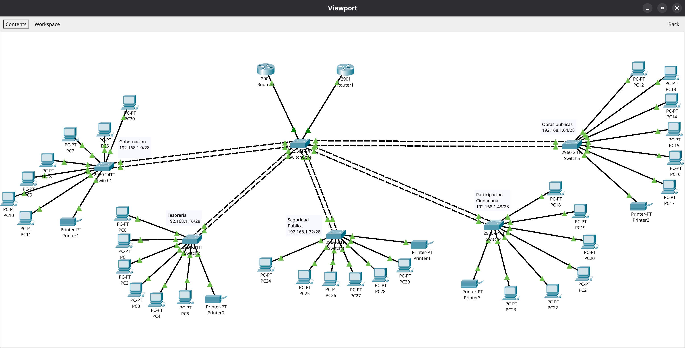

# packet-tracer-hsrp-etherchannel-network
Enterprise high-availability network simulation using Cisco Packet Tracer, EtherChannel, HSRP and departmental subnet segmentation.

# High-Availability Enterprise Network

Enterprise network simulation developed in Cisco Packet Tracer for a fictional multimedia and digital animation company.

The objective was to design a segmented and resilient corporate network using EtherChannel for aggregated switch links and HSRP for default gateway redundancy.

## Project Overview

The network consists of five departmental segments connected through a central core switch.

Each department has its own access switch and subnet. The access switches connect to the core using EtherChannel links composed of two FastEthernet interfaces.

Two routers were configured using HSRP to provide a shared virtual default gateway and maintain network availability if the primary router becomes unavailable.

## Main Features

- Star network topology
- Five departmental network segments
- Core and access switch architecture
- EtherChannel links between switches
- Two-interface link aggregation
- HSRP gateway redundancy
- Virtual default gateways
- Failover capability
- Department-based IPv4 addressing
- Connectivity and availability testing

## Network Departments

- Governance
- Treasury
- Security
- Citizen Participation
- Public Works

## EtherChannel Implementation

Each access switch was connected to the core switch through an EtherChannel group using two FastEthernet interfaces.

This design provided:

- Increased logical link bandwidth
- Reduced link saturation
- Link redundancy
- Improved availability between switches

## HSRP Implementation

HSRP was used to create a redundant default gateway for every department.

Each subnet included:

- One primary router address
- One secondary router address
- One shared virtual IP address

If the primary router became unavailable, the secondary router could assume the gateway role.

## Validation Tests

The project validation included:

- Connectivity testing between endpoints
- Default gateway verification
- IP addressing review
- EtherChannel link verification
- HSRP active and standby role validation
- Gateway failover testing
- General network functionality testing

## My Contributions

This project was developed collaboratively. My main responsibilities included:

- Reviewing and validating router and switch configurations.
- Performing connectivity tests across the network.
- Testing EtherChannel and HSRP functionality.
- Detecting configuration and connectivity issues.
- Organizing the technical evidence.
- Preparing the final documentation and presentation.
- Presenting the project design and results.

## Skills Demonstrated

- Cisco Packet Tracer
- Enterprise network design
- Layer 2 switching
- EtherChannel
- HSRP
- Network redundancy
- IPv4 subnetting
- Connectivity testing
- Configuration validation
- Network troubleshooting
- Technical documentation
- Technical presentation
- Team collaboration

## Limitations and Possible Improvements

- The central core switch remains a single point of failure.
- A second core switch could improve infrastructure redundancy.
- Rapid PVST+ or another spanning-tree configuration could be added.
- VLANs and trunk links could provide clearer logical segmentation.
- Additional monitoring and security controls could be implemented.

## Academic Context

Collaborative final project for the Local Network Switching course.

This repository is shared for educational and portfolio purposes.
